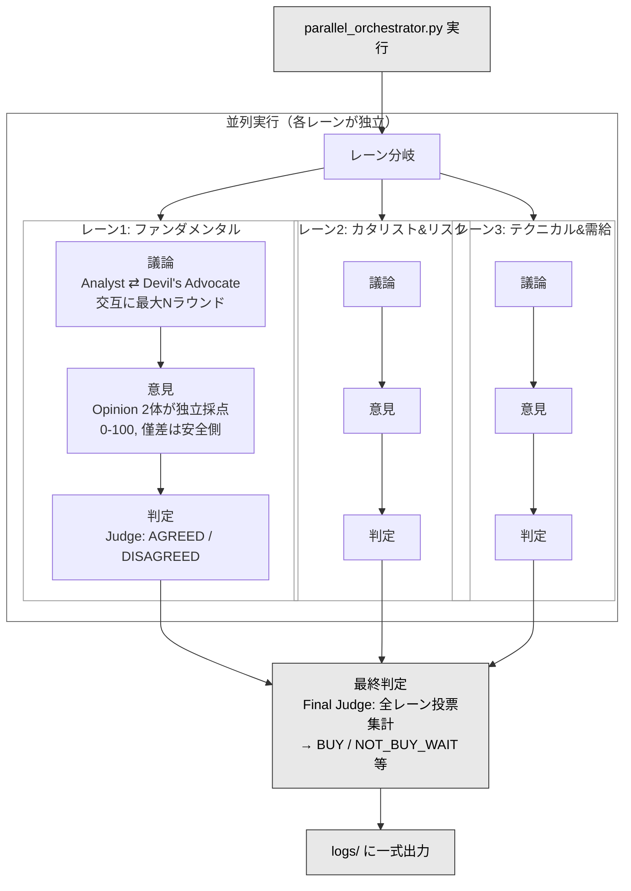

# Discusion プロジェクトまとめ

## 何をするプロジェクトか

株式銘柄の投資判断を **対立議論形式** で行うシステム。
「買うべきか/売るべきか」を AI エージェント同士が議論し、複数の独立した意見者が採点し、投票で最終結論を出す。
自動売買ではなく、根拠付きの行動案をログとして出力するところまでが責務。

---

## 技術スタック

- **Python 3.10+**（async/await + anyio で並列処理）
- **Claude Haiku 4.5**（claude-agent-sdk 経由でサブエージェント呼び出し）
- 仮想環境は `src/.venv/` に隔離

---

## 処理フロー（5フェーズ）



### 投票ルール
- AGREED レーン → 2票、DISAGREED レーン → 各 side に1票ずつ
- **買うモード**: 全会一致のみ BUY（1票でも反対 → NOT_BUY_WAIT）
- **売るモード**: SELL票 ≥ 2/3 なら SELL

---

## 2層の設計

| 層 | 場所 | 役割 |
|----|------|------|
| オーケストレーター | `src/*.py` | フロー制御・並列実行・投票集計・ファイルI/O（LLM不使用） |
| サブエージェント | `.claude/commands/*.md` | LLMがテキスト応答を返すだけ（ファイル書き込みしない） |

オーケストレーターがエージェントを呼び出し → エージェントがテキスト応答 → オーケストレーターがファイルに書き出す。

---

## サブエージェント（5体）

| エージェント | ファイル | 役割 |
|-------------|----------|------|
| Analyst | `analyst.md` | 銘柄を分析し Facts → Claims を組み立てる。Web検索可 |
| Devil's Advocate | `devils-advocate.md` | Analyst の stance の反対側に固定して反論。Web検索可 |
| Opinion | `opinion.md` | 議論ログを読み BUY/NOT_BUY を 0-100 で採点 + 軽量監査 |
| Judge | `judge.md` | 2つの Opinion の supported_side が一致か不一致か判定 |
| Final Judge | `final-judge.md` | 全レーンの投票を集約し最終結論を出す |

全エージェントが `stock-log-protocol` スキル（ログの ID 体系・フォーマット共通ルール）を遵守する。

---

## ログの ID 体系（stock-log-protocol）

議論ログ内の情報は以下の ID で管理され、根拠の連鎖を辿れる。

```
S#（参照元）→ F#（事実）→ C#（主張）→ 暫定結論
```

| ID | 用途 | 例 |
|----|------|-----|
| S# | Sources（参照元。type + retrieved_at 必須） | `S3: Yahoo Finance, 2026-02-09` |
| F# | Facts（事実。必ず S# 付き） | `F12[S3]: PER=29.3x` |
| C# | Claims（主張。根拠の F# を明記） | `C1[F1,F2]: 成長と利益改善` |
| H# | Hypotheses（S# 無し推測の避難場所） | |
| R# | Risks / Q# Open Questions / A# Actions | |

---

## 実行方法

```bash
python src/parallel_orchestrator.py <銘柄> <期間> [モード] [レーン数] [最大ラウンド数] [意見数] [追加指示]

# 例
python src/parallel_orchestrator.py AMZN 中期
python src/parallel_orchestrator.py NVDA 長期 売る 2 4
```

出力は `logs/{YYMMDD_HHMM}/` に議論ログ・判定・最終判定が一式生成される。

---

## ディレクトリ構造

```
Discusion/
├── src/                           # オーケストレーター群（Python）
│   ├── parallel_orchestrator.py   #   エントリーポイント
│   ├── lane_orchestrator.py       #   1レーン制御
│   ├── discussion_orchestrator.py #   議論ループ
│   ├── opinion_orchestrator.py    #   意見生成
│   ├── judge_orchestrator.py      #   一致判定
│   ├── final_judge_orchestrator.py#   最終判定
│   └── AgentUtil.py               #   SDK ユーティリティ
├── .claude/commands/              # サブエージェント定義（5体）
├── .claude/skills/                # stock-log-protocol（ログ共通ルール）
├── logs/                          # 実行結果の出力先
├── MyDocs/                        # 理解用ドキュメント
└── 参考/                           # リファレンス実装
```
