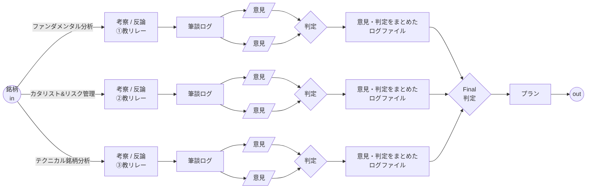

# ワークフロー

```mermaid
flowchart LR
    in((銘柄<br>in))

    in -- ファンダメンタル分析 --> KH1["考察 / 反論<br>①教リレー"]
    in -- "カタリスト&リスク管理" --> KH2["考察 / 反論<br>②教リレー"]
    in -- テクニカル銘柄分析 --> KH3["考察 / 反論<br>③教リレー"]

    KH1 --> LOG1[筆談ログ]
    KH2 --> LOG2[筆談ログ]
    KH3 --> LOG3[筆談ログ]

    LOG1 --> O1A[/意見/]
    LOG1 --> O1B[/意見/]
    LOG2 --> O2A[/意見/]
    LOG2 --> O2B[/意見/]
    LOG3 --> O3A[/意見/]
    LOG3 --> O3B[/意見/]

    O1A --> J1{判定}
    O1B --> J1
    O2A --> J2{判定}
    O2B --> J2
    O3A --> J3{判定}
    O3B --> J3

    J1 --> F1["意見・判定をまとめた<br>ログファイル"]
    J2 --> F2["意見・判定をまとめた<br>ログファイル"]
    J3 --> F3["意見・判定をまとめた<br>ログファイル"]

    F1 --> FJ{"Final<br>判定"}
    F2 --> FJ
    F3 --> FJ

    FJ --> P[プラン]
    P --> out((out))
```

# aa
- a
- b