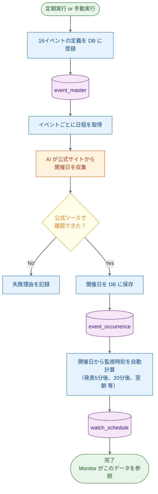
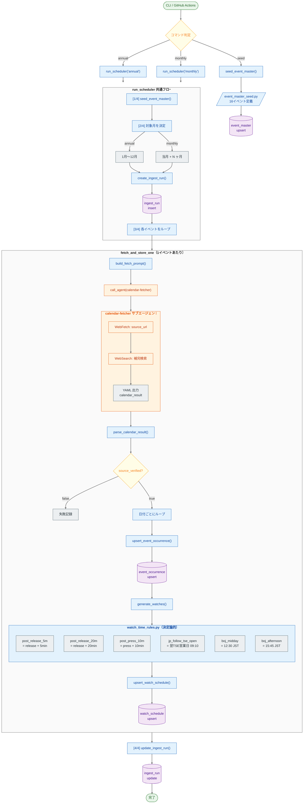
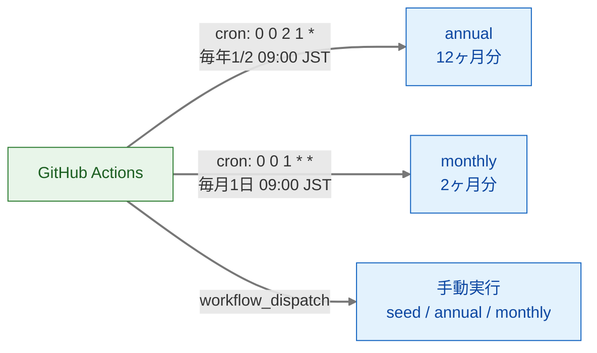
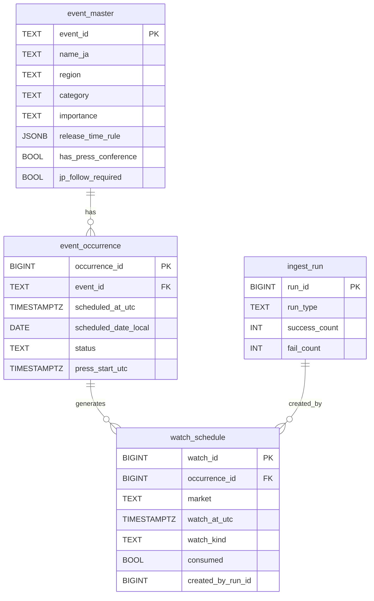

# EventScheduler ワークフロー

## 概要フロー

```mermaid
%%{init: {'themeVariables': {'lineColor': '#777'}}}%%
flowchart TD
    classDef trigger fill:#E8F5E9,stroke:#2E7D32,color:#1B5E20
    classDef process fill:#E3F2FD,stroke:#1565C0,color:#0D47A1
    classDef agent fill:#FFF3E0,stroke:#E65100,color:#BF360C
    classDef db fill:#F3E5F5,stroke:#6A1B9A,color:#4A148C
    classDef decision fill:#FFFDE7,stroke:#F9A825,color:#F57F17

    START(["定期実行 or 手動実行"]):::trigger
    START --> SEED["16イベントの定義を DB に登録"]:::process
    SEED --> DB1[("event_master")]:::db

    DB1 --> LOOP["イベントごとに日程を取得"]:::process
    LOOP --> AI["AI が公式サイトから\n開催日を収集"]:::agent
    AI --> CHK{公式ソースで\n確認できた？}:::decision

    CHK -->|No| SKIP["失敗理由を記録"]:::process
    CHK -->|Yes| SAVE["開催日を DB に保存"]:::process
    SAVE --> DB2[("event_occurrence")]:::db

    DB2 --> WATCH["開催日から監視時刻を自動計算\n（発表5分後、20分後、翌朝 等）"]:::process
    WATCH --> DB3[("watch_schedule")]:::db

    DB3 --> DONE(["完了\nMonitor がこのデータを参照"]):::trigger
    linkStyle default stroke-width:2px
```

---

## 詳細フロー（開発リファレンス）

```mermaid
%%{init: {'themeVariables': {'lineColor': '#777'}}}%%
flowchart TD
    classDef trigger fill:#E8F5E9,stroke:#2E7D32,color:#1B5E20
    classDef process fill:#E3F2FD,stroke:#1565C0,color:#0D47A1
    classDef agent fill:#FFF3E0,stroke:#E65100,color:#BF360C
    classDef db fill:#F3E5F5,stroke:#6A1B9A,color:#4A148C
    classDef decision fill:#FFFDE7,stroke:#F9A825,color:#F57F17
    classDef output fill:#ECEFF1,stroke:#455A64,color:#263238

    START(["CLI / GitHub Actions"]) --> CMD{コマンド判定}
    START:::trigger
    CMD:::decision

    CMD -->|seed| SEED["seed_event_master()"]
    CMD -->|annual| RUN["run_scheduler('annual')"]
    CMD -->|monthly| RUN2["run_scheduler('monthly')"]
    SEED:::process

    RUN:::process
    RUN2:::process

    SEED --> UPSERT_MASTER[/"event_master_seed.py\n16イベント定義"/]
    UPSERT_MASTER:::process
    UPSERT_MASTER --> DB_MASTER[("event_master\nupsert")]
    DB_MASTER:::db

    RUN --> FLOW
    RUN2 --> FLOW

    subgraph FLOW ["run_scheduler 共通フロー"]
        direction TB
        style FLOW fill:#FAFAFA,stroke:#616161,color:#212121,font-weight:bold

        S1["[1/4] seed_event_master()"] --> S2["[2/4] 対象月を決定"]
        S1:::process
        S2:::process

        S2 -->|annual| MONTHS_A["1月〜12月"]
        S2 -->|monthly| MONTHS_M["当月 + N ヶ月"]
        MONTHS_A:::output
        MONTHS_M:::output

        MONTHS_A --> S2b
        MONTHS_M --> S2b

        S2b["create_ingest_run()"] --> DB_RUN[("ingest_run\ninsert")]
        S2b:::process
        DB_RUN:::db

        DB_RUN --> S3["[3/4] 各イベントをループ"]
        S3:::process
    end

    S3 --> FETCH

    subgraph FETCH ["fetch_and_store_one（1イベントあたり）"]
        direction TB
        style FETCH fill:#FAFAFA,stroke:#616161,color:#212121,font-weight:bold

        F1["build_fetch_prompt()"] --> F2["call_agent(calendar-fetcher)"]
        F1:::process
        F2:::agent

        F2 --> F2a

        subgraph F2a ["calendar-fetcher サブエージェント"]
            direction TB
            style F2a fill:#FFF3E0,stroke:#E65100,color:#E65100,font-weight:bold
            WF["WebFetch: source_url"] --> WS["WebSearch: 補完検索"]
            WF:::agent
            WS:::agent
            WS --> YAML_OUT["YAML 出力\ncalendar_result"]
            YAML_OUT:::output
        end

        F2a --> F3["parse_calendar_result()"]
        F3:::process
        F3 --> F3_CHK{source_verified?}
        F3_CHK:::decision

        F3_CHK -->|false| F_FAIL["失敗記録"]
        F_FAIL:::output

        F3_CHK -->|true| F4["日付ごとにループ"]
        F4:::process

        F4 --> F5["upsert_event_occurrence()"]
        F5:::process
        F5 --> DB_OCC[("event_occurrence\nupsert")]
        DB_OCC:::db

        DB_OCC --> F6["generate_watches()"]
        F6:::process

        F6 --> F6a

        subgraph F6a ["watch_time_rules.py（決定論的）"]
            direction TB
            style F6a fill:#E3F2FD,stroke:#1565C0,color:#0D47A1,font-weight:bold
            W1["post_release_5m\n= release + 5min"]
            W2["post_release_20m\n= release + 20min"]
            W3["post_press_10m\n= press + 10min"]
            W4["jp_follow_tse_open\n= 翌TSE営業日 09:10"]
            W5["boj_midday\n= 12:30 JST"]
            W6["boj_afternoon\n= 15:45 JST"]
            W1:::output
            W2:::output
            W3:::output
            W4:::output
            W5:::output
            W6:::output
        end

        F6a --> F7["upsert_watch_schedule()"]
        F7:::process
        F7 --> DB_WS[("watch_schedule\nupsert")]
        DB_WS:::db
    end

    FETCH --> S4["[4/4] update_ingest_run()"]
    S4:::process
    S4 --> DB_RUN_UPD[("ingest_run\nupdate")]
    DB_RUN_UPD:::db
    DB_RUN_UPD --> DONE(["完了"])
    DONE:::trigger
    linkStyle default stroke-width:2px
```

## トリガー

```mermaid
%%{init: {'themeVariables': {'lineColor': '#777'}}}%%
flowchart LR
    classDef trigger fill:#E8F5E9,stroke:#2E7D32,color:#1B5E20
    classDef schedule fill:#E3F2FD,stroke:#1565C0,color:#0D47A1

    GHA["GitHub Actions"]:::trigger

    GHA -->|"cron: 0 0 2 1 *\n毎年1/2 09:00 JST"| ANNUAL["annual\n12ヶ月分"]:::schedule
    GHA -->|"cron: 0 0 1 * *\n毎月1日 09:00 JST"| MONTHLY["monthly\n2ヶ月分"]:::schedule
    GHA -->|"workflow_dispatch"| MANUAL["手動実行\nseed / annual / monthly"]:::schedule
    linkStyle default stroke-width:2px
```

## DB テーブル関係

```mermaid
%%{init: {'themeVariables': {'lineColor': '#777'}}}%%
erDiagram
    event_master ||--o{ event_occurrence : "has"
    event_occurrence ||--o{ watch_schedule : "generates"
    ingest_run ||--o{ watch_schedule : "created_by"

    event_master {
        TEXT event_id PK
        TEXT name_ja
        TEXT region
        TEXT category
        TEXT importance
        JSONB release_time_rule
        BOOL has_press_conference
        BOOL jp_follow_required
    }

    event_occurrence {
        BIGINT occurrence_id PK
        TEXT event_id FK
        TIMESTAMPTZ scheduled_at_utc
        DATE scheduled_date_local
        TEXT status
        TIMESTAMPTZ press_start_utc
    }

    watch_schedule {
        BIGINT watch_id PK
        BIGINT occurrence_id FK
        TEXT market
        TIMESTAMPTZ watch_at_utc
        TEXT watch_kind
        BOOL consumed
        BIGINT created_by_run_id
    }

    ingest_run {
        BIGINT run_id PK
        TEXT run_type
        INT success_count
        INT fail_count
    }
```
