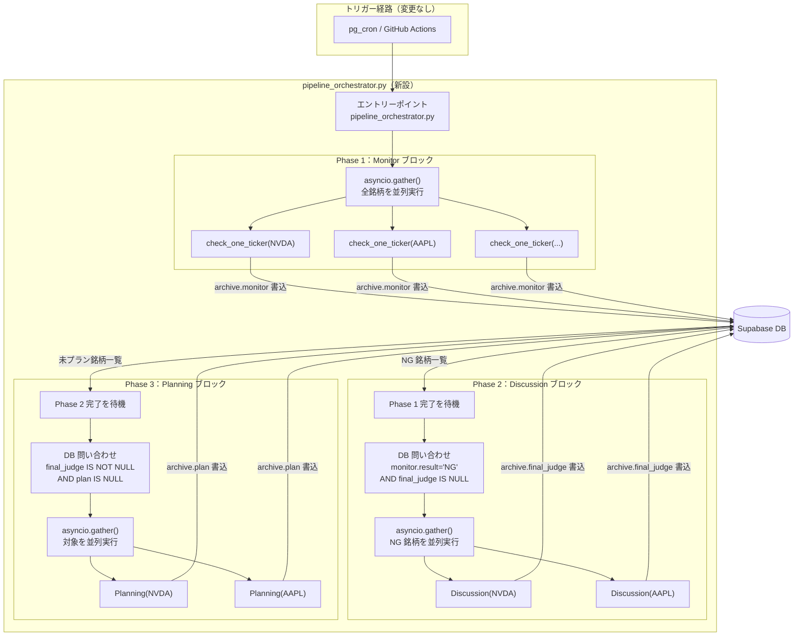

# 新アーキテクチャ設計提案

> 現実装の概要は `architecture-current.md` を参照。

---

## 1. 設計変更の背景と意図

### 課題 A：Monitor が「監視」と「下流起動」の 2 つの責務を持っている

現状、`ng_dispatch.py` が Monitor の実行を制御しながら、NG 銘柄が出た際に Discussion/Planning を subprocess で起動する役割も担っている。
この設計では Monitor の改修がパイプライン全体の制御ロジックに影響しやすく、責務の境界が曖昧になっている。

### 課題 B：ブロック間の連携が CLI 引数（直接的な依存）

`ng_dispatch.py` → `discuss_and_plan.py` に `ticker, span, mode` を CLI 引数として渡している。
引数の追加・変更が複数スクリプトにまたがる契約変更を要し、ブロック間が密結合になっている。

### 新設計のゴール

- 各ブロックは「DB に書いて終わり」「DB を読んで動くだけ」の単純な責務にする（**伝言板方式**）
- パイプライン制御は専用の `pipeline_orchestrator.py` が担い、各ブロックは自分の処理だけに集中する

---

## 2. 新設計の全体フロー



---

## 3. 現実装との比較

| 観点 | 現実装 | 新設計 |
|------|--------|--------|
| オーケストレーター | `Monitor/src/ng_dispatch.py` | `pipeline_orchestrator.py`（新設） |
| ブロック間の情報渡し | CLI 引数（ticker / span / mode）＋ DB | **DB のみ（伝言板方式）** |
| ティッカー処理 | 逐次（`for` ループ） | ブロック内並列（`asyncio.gather()`） |
| Monitor の責務 | 監視 ＋ Discussion/Planning 起動 | **監視のみ** |
| NG 検出後の動作 | Monitor が即座に subprocess 起動 | Monitor 完了後にオーケストレータが一括起動 |
| 新規ファイル | — | `pipeline_orchestrator.py` |
| 廃止候補ファイル | — | `ng_dispatch.py` / `discuss_and_plan.py`（責務移管後） |
| 変更対象ファイル | — | `monitor_orchestrator.py`（並列化） |

---

## 4. 新設計の詳細

### pipeline_orchestrator.py（新設）

パイプライン全体を制御する専用エントリーポイント。各フェーズを順番に待機実行する。

```python
# 擬似コード（インターフェースのイメージ）
async def main():
    await run_monitor_block(market)            # Phase 1：全銘柄を並列チェック
    ng_archivelogs = fetch_ng_without_judge()     # DB：NG かつ未議論のアーカイブログを取得
    await run_discussion_block(ng_archivelogs)    # Phase 2：NG 銘柄を並列議論
    pending = fetch_archivelogs_needing_plan()    # DB：議論済みかつ未プランのアーカイブログを取得
    await run_planning_block(pending)          # Phase 3：対象銘柄を並列プラン生成
```

**Discord 通知もここに集約：** START / ERROR / COMPLETE 通知は `pipeline_orchestrator.py` が担い、
`ng_dispatch.py` から責務を移管する。

### Monitor ブロック（変更内容）

`monitor_orchestrator.py::run_monitor()` の内部変更のみ。外部インターフェースは維持。

- **変更前：** `for ticker in tickers:` による逐次処理
- **変更後：** `await asyncio.gather(*[check_one_ticker(t) for t in tickers])` による並列処理

`ng_dispatch.py` の「NG 銘柄を subprocess で起動する」ロジックは削除（または `pipeline_orchestrator.py` に移管）。

### Discussion ブロック（変更内容）

**最小限の変更。** `parallel_orchestrator.py` の内部ロジックは変更不要（編集不可制約あり）。

呼び出し元が `discuss_and_plan.py`（subprocess） → `pipeline_orchestrator.py` に変わるだけ。
Discussion が DB に書く内容（`archive.final_judge` / `archive.lanes`）は変わらない。

### Planning ブロック（変更内容）

**変更なし。** Planning はすでに DB から `archive.final_judge` を読み取る設計になっているため、
呼び出し元が変わっても影響は生じない（編集不可制約あり）。

---

## 5. DB 伝言板方式の詳細

各フェーズは「DB に書いて終わり」、次フェーズは「DB を読んで始まる」という疎結合な設計。

| フェーズ | 書き込み内容 | 次フェーズの開始条件（DB 問い合わせ） |
|---------|------------|--------------------------------------|
| Monitor | `archive.monitor` | `monitor.result = 'NG' AND final_judge IS NULL` |
| Discussion | `archive.final_judge` | `final_judge IS NOT NULL AND plan IS NULL` |
| Planning | `archive.plan` | —（パイプライン完了） |

ブロック間で CLI 引数を渡す必要がなくなるため、各ブロックを独立して再実行できる。
例：Monitor 後に手動で DB レコードを確認し、Discussion だけ単体で走らせることも可能になる。

---

## 6. メリット

1. **疎結合** — ブロック間の直接依存（CLI 引数）がなくなり、各ブロックが DB の特定カラムのみを意識すれば良い
2. **テスト容易性** — 各フェーズを独立して実行できる。DB に手動でレコードを作るだけで特定フェーズだけ動かせる
3. **並列処理によるスループット向上** — 銘柄数が増えた際、全ティッカーを同時にチェック・議論・プラン生成できる
4. **責務の明確化** — Monitor は「チェックして DB に書く」だけ。パイプライン制御は専用ファイルに集約される

---

## 7. トレードオフと課題

### NG 時の待機時間増加

現実装は1件 NG 検出後すぐに Discussion を開始できる（Monitor と Discussion が並走）。
新設計では全銘柄の Monitor 完了を待ってから Discussion を一括開始するため、
watchlist が大きいほど最初の Discussion 開始が遅れる。

> watchlist が 20 件前後であれば許容範囲。銘柄が増えた場合は再検討の余地あり。

### 一部失敗時のリカバリ設計

並列処理では1件失敗しても他は継続するため、失敗した銘柄だけ再実行するリトライ戦略が必要になる。
現実装の逐次リトライと異なり、並列実行後の失敗収集・再実行ロジックを設計する必要がある。

### 新規ファイルの作成コスト

`ng_dispatch.py` と `discuss_and_plan.py` の機能を `pipeline_orchestrator.py` に整理・移管する作業が必要。

### Discussion/Planning の呼び出し形式

Discussion / Planning は編集不可制約があるため、現行の subprocess（CLI）呼び出しのまま維持することが現実的。
関数インターフェースへの変更は各モジュールオーナーへの承認・作業依頼が必要になる。
