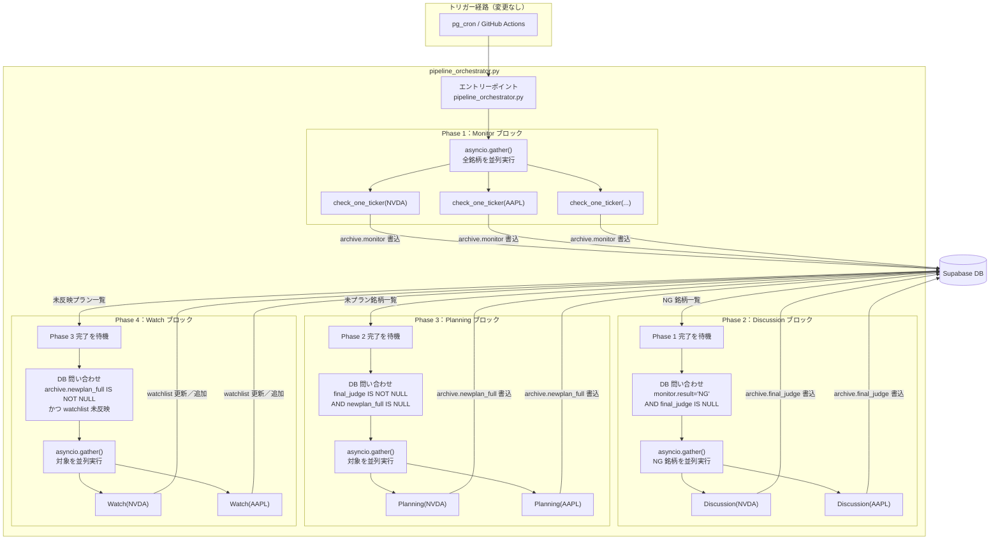

# 新アーキテクチャ設計

> 旧実装の概要は `過去のシステムアーキテクチャ.md` を参照。

---

## 1. 設計変更の背景と意図

### 課題 A：Monitor が「監視」と「下流起動」の 2 つの責務を持っている

現状、`ng_dispatch.py` が Monitor の実行を制御しながら、NG 銘柄が出た際に Discussion/Planning を subprocess で起動する役割も担っている。
この設計では Monitor の改修がパイプライン全体の制御ロジックに影響しやすく、責務の境界が曖昧になっている。

### 課題 B：ブロック間の連携が CLI 引数（直接的な依存）

`ng_dispatch.py` → `discuss_and_plan.py` に `ticker, span, mode` を CLI 引数として渡している。
引数の追加・変更が複数スクリプトにまたがる契約変更を要し、ブロック間が密結合になっている。

### 新設計のゴール

- 各ブロックは「DB に書いて終わり」「DB を読んで動くだけ」の単純な責務にする（**伝言板方式**）
- パイプライン制御は専用の `pipeline_orchestrator.py` が担い、各ブロックは自分の処理だけに集中する

---

## 2. 新設計の全体フロー



---

## 3. 旧実装との比較

| 観点 | 旧実装 | 現行設計 |
|------|--------|---------|
| オーケストレーター | `Monitor/src/ng_dispatch.py` | `pipeline_orchestrator.py` |
| ブロック間の情報渡し | CLI 引数（ticker / span / mode）＋ DB | **DB のみ（伝言板方式）** |
| ティッカー処理 | 逐次（`for` ループ） | ブロック内並列（`asyncio.gather()`） |
| Monitor の責務 | 監視 ＋ Discussion/Planning 起動 | **監視のみ** |
| NG 検出後の動作 | Monitor が即座に subprocess 起動 | NG 銘柄すべてを並列で Discussion させる |
| Planning の責務 | プラン生成 ＋ Discord 通知 | **プラン生成のみ（`archive.newplan_full` 書き込みで完了）** |
| Discord 通知（業務判定系） | Planning が送信 | **Watch ブロックが送信（【緊急】【警告】【朗報】）** |
| watchlist 更新 | なし（手動または Monitor のみ） | **Watch ブロックが自動更新** |
| 廃止済みファイル | — | `ng_dispatch.py` / `discuss_and_plan.py`（責務移管完了・削除済み） |

---

## 4. 新設計の詳細

### pipeline_orchestrator.py

パイプライン全体を制御する専用エントリーポイント。各フェーズを順番に待機実行する。

```python
# 擬似コード（インターフェースのイメージ）
async def main():
    run_technical_block(market)                  # Phase 1：テクニカル指標取得 + archive 作成
    await run_monitor_block(market)              # Phase 2：全銘柄を並列チェック
    ng_archivelogs = fetch_ng_without_judge()    # DB：NG かつ未議論のアーカイブログを取得
    await run_discussion_block(ng_archivelogs)   # Phase 3：NG 銘柄を並列議論
    pending = fetch_archivelogs_needing_plan()   # DB：議論済みかつ未プランのアーカイブログを取得
    await run_planning_block(pending)            # Phase 4：対象銘柄を並列プラン生成
    to_watch = fetch_archivelogs_needing_watch() # DB：プラン済みかつ watchlist 未反映のアーカイブログを取得
    await run_watch_block(to_watch)              # Phase 5：watchlist を更新／追加
```

**Discord 通知（制御系）：** START / ERROR / COMPLETE 通知は `pipeline_orchestrator.py` が担う。
業務判定系の通知（【確認】【緊急】【警告】【朗報】）は Watch ブロックが担当する。

### Technical ブロック

`technical_orchestrator.py` が watchlist 全銘柄のテクニカル指標を取得し、archive レコードを作成する。
TechnicalIndicatorFetcher（自作ライブラリ）を使用し、yfinance 経由で OHLCV データを取得して指標を算出する。

### Monitor ブロック

`monitor_orchestrator.py::run_monitor()` で `await asyncio.gather(*[check_one_ticker(t) for t in tickers])` による並列処理を行う。
Technical が作成した archive レコードにチェック結果を書き足す。archive レコードの新規作成は行わない（Technical が作成済み）。

### Discussion ブロック

Technical/Monitor が書き込んだ既存 archive レコードに `lanes` / `final_judge` を書き足す。
従来のように別レコードを作成しないため、`propagate_active_after_discussion()` は不要になり削除済み。

### Planning ブロック

`archive.final_judge` を読み取ってプラン YAML を生成し、`archive.newplan_full` に書き込むのみ。
Discord 通知の責務は Watch ブロックへ移管済み。

### Watch ブロック

プラン完成後に `archive` の内容をもとに watchlist を最新化し、業務判定系の Discord 通知を送る専用ブロック。

**処理の流れ：**

1. `archive.newplan_full` / `archive.monitor` / `archive.final_judge` を読み取る
2. プランの内容・判定結果・モニタリング情報からサマリーを生成
3. `watchlist` テーブルを更新または新規追加
4. `classify_label()` でラベルを判定し、Discord に業務通知（【確認】【緊急】【警告】【朗報】）を送信
5. `archive.active` を `False` に更新

**配置：** `Watch/` ディレクトリとして新設（Monitor / Discussion / Planning と同列のブロック）

---

## 5. DB 伝言板方式の詳細

各フェーズは「DB に書いて終わり」、次フェーズは「DB を読んで始まる」という疎結合な設計。

| フェーズ | 書き込み先テーブル・カラム | 次フェーズの開始条件（DB 問い合わせ） |
|---------|--------------------------|--------------------------------------|
| Technical | `archive`: `id`, `created_at`, `ticker`, `mode`, `span`, `technical` | `technical IS NOT NULL AND monitor IS NULL` |
| Monitor | `archive`: `monitor`, `MotivationID`, `motivation_full`, `active`, `status` | `active = True AND final_judge IS NULL` |
| Discussion | `archive`: `lanes`, `final_judge` | `active = True AND final_judge IS NOT NULL AND newplan_full IS NULL` |
| Planning | `archive`: `newplan_full`, `verdict` | `active = True AND status = 'completed' AND newplan_full IS NOT NULL` |
| Watch | `watchlist`: `MotivationID`, `motivation_summary`, `discussion_result`, `discussion_summary`, `new_plan_summary`, `risk_flags`, `plan_comparison`, `stock_price`<br>`archive`: `active`（False に戻す） | —（パイプライン完了） |

全ブロックが同一の archive レコードに順番に書き足す。ブロックごとに別レコードを作らない。

ブロック間で CLI 引数を渡す必要がなくなるため、各ブロックを独立して再実行できる。
例：Monitor 後に手動で DB レコードを確認し、Discussion だけ単体で走らせることも可能になる。

---

## 6. メリット

1. **疎結合** — ブロック間の直接依存（CLI 引数）がなくなり、各ブロックが DB の特定カラムのみを意識すれば良い
2. **テスト容易性** — 各フェーズを独立して実行できる。DB に手動でレコードを作るだけで特定フェーズだけ動かせる
3. **並列処理によるスループット向上** — 銘柄数が増えた際、全ティッカーを同時にチェック・議論・プラン生成できる
4. **責務の明確化** — Monitor は「チェックして DB に書く」だけ。パイプライン制御は専用ファイルに集約される

---

## 7. トレードオフと既知の制約

### NG 時の待機時間

全銘柄の Monitor 完了を待ってから Discussion を一括開始するため、
watchlist が大きいほど最初の Discussion 開始が遅れる。

> watchlist が 20 件前後であれば許容範囲。銘柄が増えた場合は再検討の余地あり。

### 一部失敗時のリカバリ

並列処理では1件失敗しても他は継続する。失敗した銘柄は `archive.status = "error"` で記録され、次回パイプライン実行時に再検出される。
