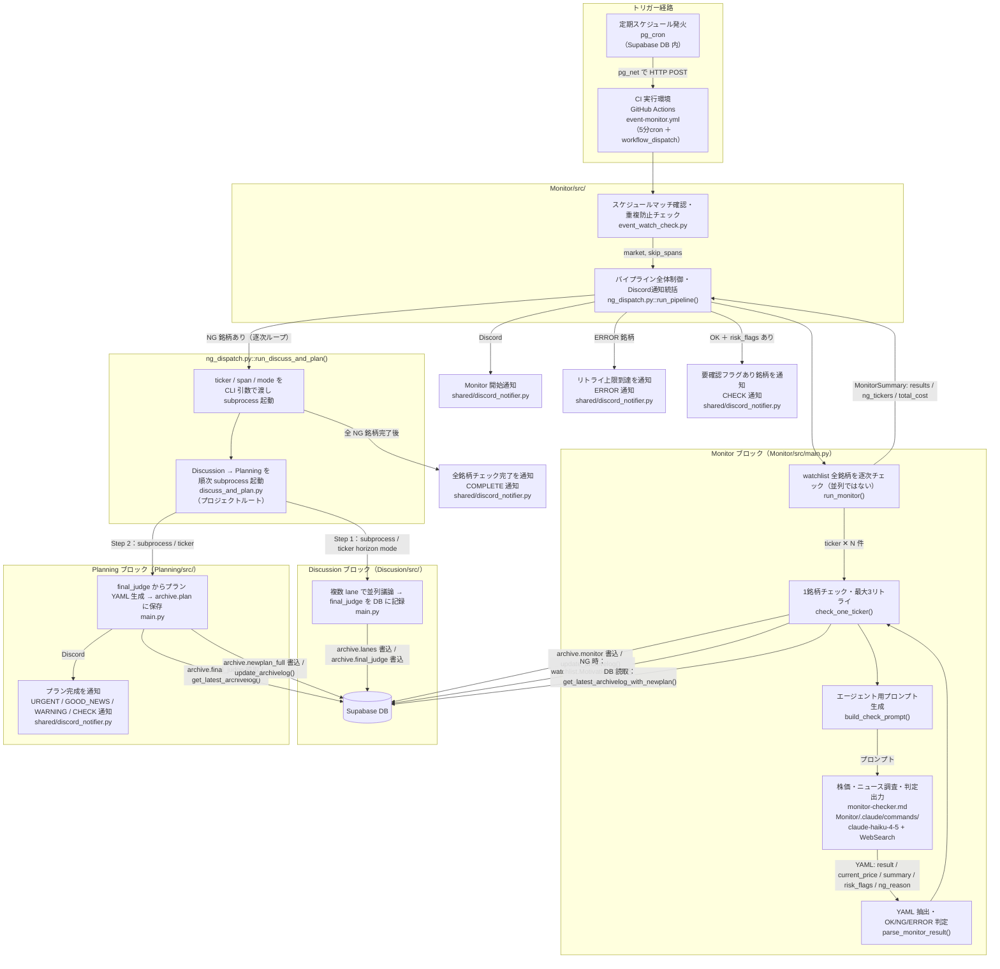

# 現在のシステムアーキテクチャ

## 1. システム概要

4つのモジュールで構成された株式投資の自動監視・判断・プラン生成システム。

| モジュール | 役割 | 編集可否 |
|-----------|------|---------|
| **Monitor** | watchlist 銘柄のプラン前提を定期チェック（OK/NG/ERROR 判定） | 可 |
| **Discussion** | 複数エージェントが議論し最終判定（BUY/SELL 等）を出す | 不可 |
| **Planning** | 最終判定からプラン YAML を生成・DB に保存 | 不可（承認要） |
| **EventScheduler** | 決算・カレンダーイベントの管理、定期監視スケジュール管理 | 不可 |

**システムのゴール：** 定期的に株価・ニュースをチェックし、プランの前提が崩れた銘柄を検出したら再議論・プラン更新を自動実行する。

---

## 2. 全体フロー



---

## 3. トリガー経路の詳細

### 経路 A：pg_cron トリガー（メイン）

```
pg_cron（Supabase DB 内）
  → pg_net で GitHub API に HTTP POST
  → GitHub Actions workflow_dispatch を発火
  → event_watch_check.py が実行される
```

登録済み pg_cron ジョブ（例）：

| ジョブ名 | cron 式 | 発火時刻（UTC） | 対応市場 |
|---------|---------|--------------|---------|
| `monitor_JP_AM` | `10 1 * * 1-5` | 月〜金 01:10 | JP（10:10 JST） |
| `monitor_JP_PM` | `0 7 * * 1-5` | 月〜金 07:00 | JP（16:00 JST） |
| `monitor_US_AM` | `0 15 * * 0-4` | 日〜木 15:00 | US（0:00 JST） |
| `monitor_US_PM` | `30 21 * * 0-4` | 日〜木 21:30 | US（6:30 JST） |

### 経路 B：GitHub Actions 5分cron（フォールバック）

```
GitHub Actions cron（5分ごと）
  → event_watch_check.py が実行される
  → スケジュールにマッチした場合のみ続行
```

pg_cron が死活停止した場合のフォールバック経路。

### 重複防止

`monitor_last_runs` テーブルに実行記録を保持し、150分以内に同スケジュールが実行済みの場合はスキップ。両経路からの二重実行を防ぐ。

---

## 4. 各ブロックの詳細

### Monitor ブロック

**エントリーポイント：** `Monitor/src/ng_dispatch.py::run_pipeline()`

| ファイル | 関数 | 役割 |
|---------|------|------|
| `Monitor/src/ng_dispatch.py` | `run_pipeline()` | パイプライン全体制御・Discord 通知統括 |
| `Monitor/src/main.py` | `run_monitor()` | watchlist 全銘柄を**逐次**チェック |
| `Monitor/src/main.py` | `check_one_ticker()` | 1銘柄チェック（最大3リトライ） |
| `Monitor/src/main.py` | `build_check_prompt()` | エージェント用プロンプト生成 |
| `Monitor/src/main.py` | `parse_monitor_result()` | YAML ブロックから結果を抽出 |
| `Monitor/.claude/commands/monitor-checker.md` | — | チェックサブエージェント（claude-haiku-4-5） |

**`check_one_ticker()` の処理ステップ：**

1. `get_latest_archivelog_with_newplan(ticker)` — DB から最新プラン付きセッションを取得
2. `build_check_prompt()` — プランの前提条件（根拠・モニタリングヒント等）を含むプロンプトを組み立て
3. `call_agent()` — `monitor-checker.md` を起動（WebSearch で株価・ニュース調査、最大3リトライ）
4. `parse_monitor_result()` — YAML ブロックを抽出し `result: OK/NG/ERROR` を判定
5. `update_archivelog()` — `archive.monitor` カラムに結果を書き込み
6. NG 時のみ `update_watchlist()` で `MotivationID=1` / `motivation_summary` をセット

**monitor-checker の出力形式（YAML）：**

```yaml
monitor_result:
  ticker: "NVDA"
  result: "OK"          # OK / NG / ERROR
  current_price: 142.50
  summary: "プランの前提は維持されている。AI需要は堅調。"
  risk_flags: []        # 定義済みフラグのリスト
  ng_reason: ""         # NG 時のみ記述
```

### Discussion ブロック

`discuss_and_plan.py` からの subprocess 呼び出しで起動。

```
Discusion/src/main.py <ticker> <horizon> <mode>
  → 複数 lane で並列議論（opinion → judge → final_judge）
  → archive.lanes に議論ログを書き込み
  → archive.final_judge に最終判定を書き込み
```

> Discussion は編集不可モジュールのため実装詳細はここでは省略。

### Planning ブロック

`discuss_and_plan.py` からの subprocess 呼び出しで起動。

```
Planning/src/main.py <ticker>
  → get_latest_archivelog() で archive.final_judge を DB から読み取り
  → 固定ルール計算（plan_calc.py）+ commentary 生成（plan-generator サブエージェント）
  → archive.plan に プラン YAML を書き込み
  → Discord 通知送信（URGENT / GOOD_NEWS / WARNING / CHECK）
```

> Planning は編集不可モジュールのため実装詳細はここでは省略。

---

## 5. DB アクセスパターン

`archive` テーブルが各ブロック間の情報媒体。

| テーブル / カラム | 書き込み元 | 読み取り元 |
|-----------------|-----------|-----------|
| `archive.monitor` | Monitor | Planning（通知構成用） |
| `archive.lanes` | Discussion | Planning（参照用） |
| `archive.final_judge` | Discussion | Planning |
| `archive.newplan_full` | Planning | Monitor（`get_latest_archivelog_with_newplan`） |
| `watchlist` | Monitor（NG 時） | Monitor（銘柄一覧取得） |
| `monitor_last_runs` | EventScheduler | EventScheduler（重複防止） |

> **禁止事項：** Discussion が書き込んだ `archive.lanes` / `archive.final_judge` は Monitor・Planning から変更不可。読み取り専用で参照すること。

---

## 6. Discord 通知の責務分担

| タイミング | 送信元ファイル | ラベル |
|-----------|--------------|--------|
| Monitor 開始 | `Monitor/src/ng_dispatch.py` | START |
| リトライ上限到達（ERROR） | `Monitor/src/ng_dispatch.py` | ERROR |
| OK ＋ risk_flags あり | `Monitor/src/ng_dispatch.py` | CHECK |
| 全銘柄チェック完了 | `Monitor/src/ng_dispatch.py` | COMPLETE |
| プラン完成 | `Planning/src/main.py` | URGENT / GOOD_NEWS / WARNING / CHECK |

通知の実装は `shared/discord_notifier.py::notify()` に統一。ラベル分類ロジックは `shared/notification_types.py::classify_label()` が担う。

---

## 7. エラーハンドリング

### Monitor のリトライ

`check_one_ticker()` は最大3回リトライ（`MAX_MONITOR_RETRIES = 3`）。全消費後：
- `retries_exhausted=True` のレコードを `archive.monitor` に書き込み
- Discord に ERROR 通知を送信
- Discussion/Planning は**起動しない**

### Discussion/Planning のリトライ

`ng_dispatch.py::run_discuss_and_plan()` が subprocess 失敗時に1回リトライ。

| 状況 | リトライ内容 |
|------|------------|
| Discussion ログが DB に存在する | `--planning-only` で Planning のみ再実行 |
| Discussion ログが存在しない | Discussion → Planning 全体を再実行 |
