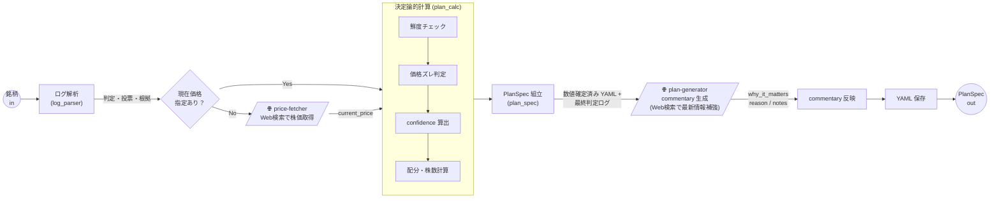

# ワークフロー

```mermaid
flowchart LR
    in((銘柄<br>in))

    in --> LP["ログ解析<br>(log_parser)"]

    LP --> |"判定・投票・根拠"| PC{"現在価格<br>指定あり？"}

    PC --> |No| PF[/"🌐 price-fetcher<br>Web検索で株価取得"/]
    PC --> |Yes| CALC

    PF --> |"current_price"| CALC

    subgraph CALC ["決定論的計算 (plan_calc)"]
        C1["鮮度チェック"] --> C2["価格ズレ判定"]
        C2 --> C3["confidence 算出"]
        C3 --> C4["配分・株数計算"]
    end

    CALC --> PS["PlanSpec 組立<br>(plan_spec)"]

    PS --> |"数値確定済み YAML +<br>最終判定ログ"| PG[/"🌐 plan-generator<br>commentary 生成<br>(Web検索で最新情報補強)"/]

    PG --> |"why_it_matters<br>reason / notes"| MG["commentary 反映"]

    MG --> OUT["YAML 保存"]
    OUT --> out((PlanSpec<br>out))
```

## 補足

- 角丸四角 `[ ]`: Python オーケストレーター処理（LLM不使用）
- 平行四辺形 `[/ /]`: サブエージェント呼び出し（LLM + Web検索）
- ひし形 `{ }`: 分岐
- `plan_calc` 内の4ステップは全て決定論的（固定ルールに基づく計算）
