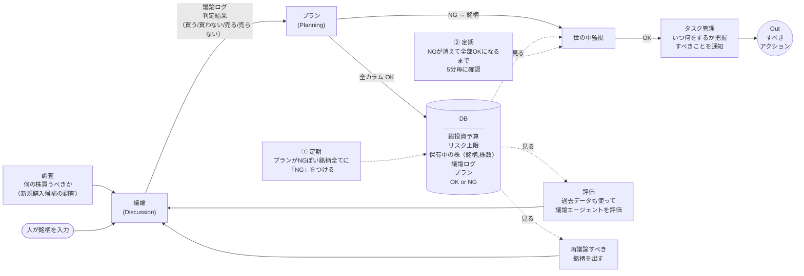

# 投資システム 全体アーキテクチャ

## ノード説明

| ノード | 役割 |
|--------|------|
| **調査** | 新規で買うのに良さげな株を調査する |
| **議論** (Discussion) | 銘柄について買う/売るの議論を行い、判定結果とログを出力 |
| **プラン** (Planning) | 議論の結果を受けて実行可能なプランを作成。資料確認・監視レベル設定・更新時期管理 |
| **DB** | 銘柄ごとのデータを一元管理（予算・リスク・保有状況・ログ・プラン・OK/NGステータス） |
| **世の中監視** | NGの銘柄について市場状況を監視する |
| **タスク管理** | いつ何をすべきか把握し、すべきアクションを通知する |
| **評価** | 過去データも使って議論エージェントの精度を評価し、改善にフィードバック |
| **再議論** | 再議論すべき銘柄を特定して議論に戻す |

## 定期トリガ

| # | トリガ | 内容 |
|---|--------|------|
| ① | 時間で自動 | プランがNGぽい銘柄全てに「NG」をつける |
| ② | 時間で自動 | NGが消えて全部OKになるまで5分毎に確認 |
